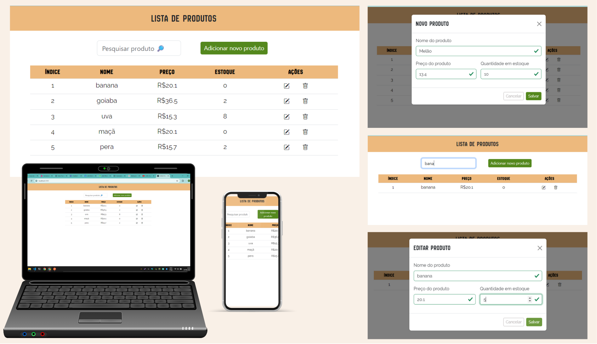

<h1 align="center">CRUD de Produtos</h1>

<p align="center">
<a href="#-layout">Layout</a>&nbsp;&nbsp;&nbsp;|&nbsp;&nbsp;&nbsp; 
<a href="#-projeto">Projeto</a>&nbsp;&nbsp;&nbsp;|&nbsp;&nbsp;&nbsp; 
<a href="#-tecnologias">Tecnologias</a>&nbsp;&nbsp;&nbsp;|&nbsp;&nbsp;&nbsp; 
<a href="#-como-executar">Como Executar</a>
</p>

## 🔖 Layout

<p align="center">
  
</p>

<br>

## 🚀 Tecnologias

Esse projeto foi desenvolvido com as seguintes tecnologias:

- TypeScript
- ReactJS
- React Bootstrap
- React Hook Form
- Yup
- Bootstrap
- Bootstrap Icons
- Sass
- PostgresSQL
- Prisma
- NestJS
- Git e Github

## 💻 Projeto

CRUD de Produtos é uma aplicação web que permite criar, visualizar, editar, deletar e pesquisar produtos. Cada produto cadastrado requer um nome, preço e quantidade em estoque, com um ID exclusivo gerado automaticamente.

---

## ⚙️ Como Executar

### Pré-requisitos

- Node.js
- PostgreSQL

### Instalação e Execução

1. Navegue até a pasta do back-end:

   ```bash
    cd ./back-end/
   ```

   ```bash
   npm install && npm run start
   ```

2. Abra um segundo terminal e navegue até a pasta do front-end:

   ```bash
    cd ./front-end/
   ```

   ```bash
   npm install && npm run start
   ```

---

Feito com ♥ por Michele Pigurim
